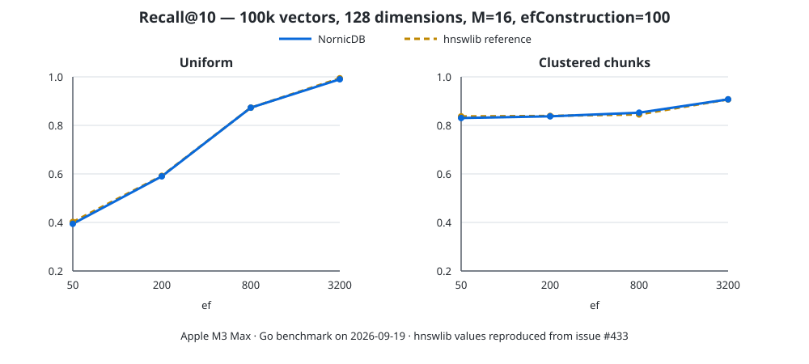

# HNSW construction recall

This benchmark compares NornicDB's corrected HNSW graph construction with the
hnswlib reference results reported for the same corpus. The workload contains
100,000 vectors with 128 dimensions and 200 queries per distribution. Both use
`M=16`, `efConstruction=100`, and recall@10 against exact cosine search.



| Distribution | ef | hnswlib | NornicDB | Difference |
| --- | ---: | ---: | ---: | ---: |
| Uniform | 50 | 0.4020 | 0.3945 | -0.0075 |
| Uniform | 200 | 0.5920 | 0.5900 | -0.0020 |
| Uniform | 800 | 0.8730 | 0.8730 | 0.0000 |
| Uniform | 3200 | 0.9940 | 0.9900 | -0.0040 |
| Clustered | 50 | 0.8370 | 0.8305 | -0.0065 |
| Clustered | 200 | 0.8390 | 0.8375 | -0.0015 |
| Clustered | 800 | 0.8450 | 0.8525 | +0.0075 |
| Clustered | 3200 | 0.9070 | 0.9075 | +0.0005 |

The corrected graph eliminates the clustered-data plateau: recall now rises
from 0.8305 to 0.9075 as `ef` increases. NornicDB is within 0.75 percentage
points of hnswlib at every measured point and exceeds the reference for the two
highest clustered settings.

## BM25 metadata stages

The clustered corpus also models its 2,000 source documents explicitly (50
chunks per document). A real `FulltextIndexV2` indexes one topic term and one
document term per source document. The same run then measures each lexical use
independently: build metadata only, query entry points only, and both together.
No extra BM25 query is executed by HNSW.

| Stage | ef=50 | ef=200 | ef=800 | ef=3200 |
| --- | ---: | ---: | ---: | ---: |
| Vector only | 0.8305 | 0.8375 | 0.8525 | 0.9075 |
| Build rank/signature only | 0.8305 | 0.8375 | 0.8525 | 0.9075 |
| BM25 query entry points | 0.9030 | 0.9155 | 0.9390 | 0.9620 |
| Combined | 0.9030 | 0.9155 | 0.9390 | 0.9620 |

Build metadata is intentionally subordinate to vector distance and affected no
choice on this corpus because its candidate distances did not tie. It provides
deterministic rare-topic diversity for equal-distance repeated/chunk vectors.
The BM25 entry points produced the material gain: +7.25 recall points at ef=50
and +5.45 points at ef=3200. Zero-hit queries fell from 6 to 1 at ef=50 and
from 1 to 0 at ef=3200.

On the same Apple M3 Max run, the clustered vector-only and lexical-metadata
builds took 8.30 s and 8.41 s respectively (+1.35%, within ordinary run
variation). Query time across 200 queries decreased slightly at every measured
ef; for example, ef=200 fell from 33.8 ms to 30.3 ms and ef=3200 from 279.8 ms
to 262.1 ms. A separate five-run 10k-vector allocation benchmark measured both
paths at 4 allocs/op: vector-only was 239–240 µs/op and 32 lexical entry points
were 237–240 µs/op.

On an Apple M3 Max, constructing the NornicDB indexes took 46.3 seconds for
the uniform corpus and 8.3 seconds for the clustered corpus. Query truth
calculation is excluded from those build timings.

Reproduce the workload with:

```bash
python3 testing/benchmarks/hnsw_recall/generate.py /tmp/hnsw-recall
go run ./testing/benchmarks/hnsw_recall /tmp/hnsw-recall
```

The generator requires NumPy. Reference values are copied from the hnswlib run
in issue #433 rather than re-benchmarked locally.
